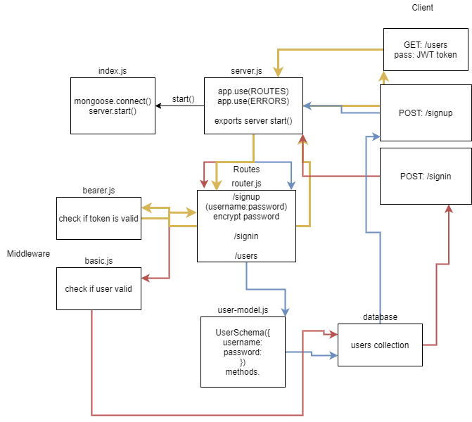

# Basic Authorization

### Author: Mark Duenas

[Test Reports](https://github.com/MarkDuenas/bearer-auth/actions)

[Deployed Link](https://bearer-auth-md.herokuapp.com/)

[Pull Req](https://github.com/MarkDuenas/bearer-auth/pull/1)

## Set up

`.env` requirements

  - PORT - Port Number
  -MONGODB_URI - MongoDB URI
  -SECRET - JWT secret 

Node.js installed

MongoDB installed

  ### Running the app
   - npm i (bring in dependencies)
   - npm start
    
   - Endpoint: POST /signup
     - Sends a username and password in the req.body and saves to database.
     - Returns JSON Object of the signed up User.

   - Endpoint: POST /singin
     - Sends a username and password in the authorization Header encoded in base64.
     - Server checks if username and password are a match in the db.
     - Returns JSON Object of a single animal that corresponds to the id.

   - Endpoint: POST /user
     - Sends a JWT token as a header.
     - Server checks if token is valid and allows access to page.
     - Returns JSON Object of a single animal that corresponds to the id.

        
  ### Tests
   - Server Tests: 
    `npm run test`
  
  ### UML

